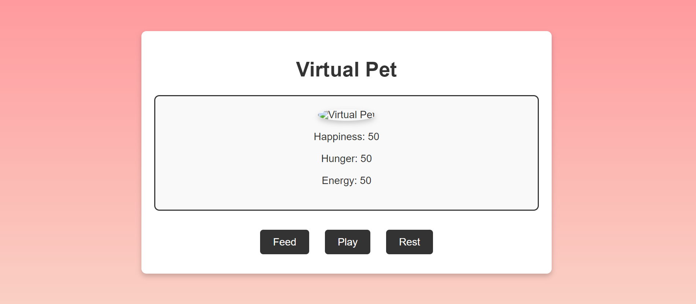
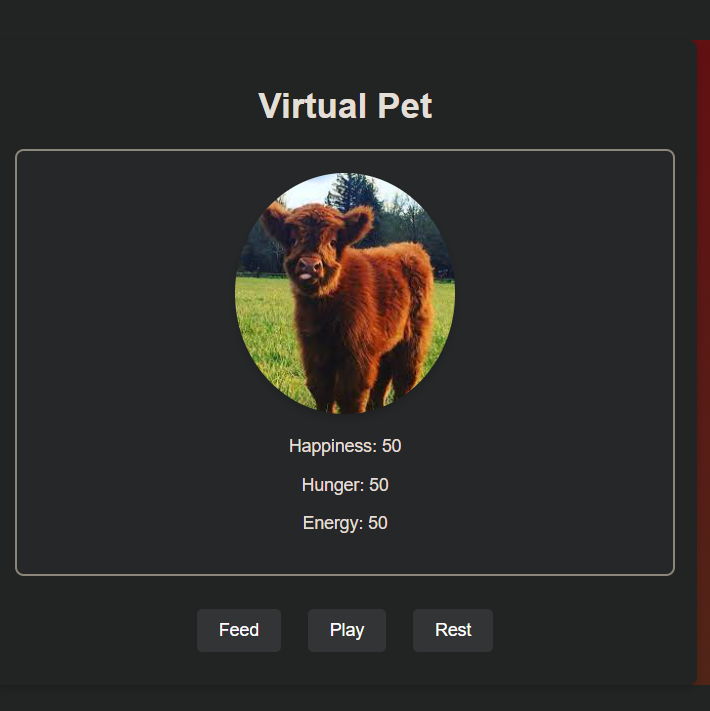
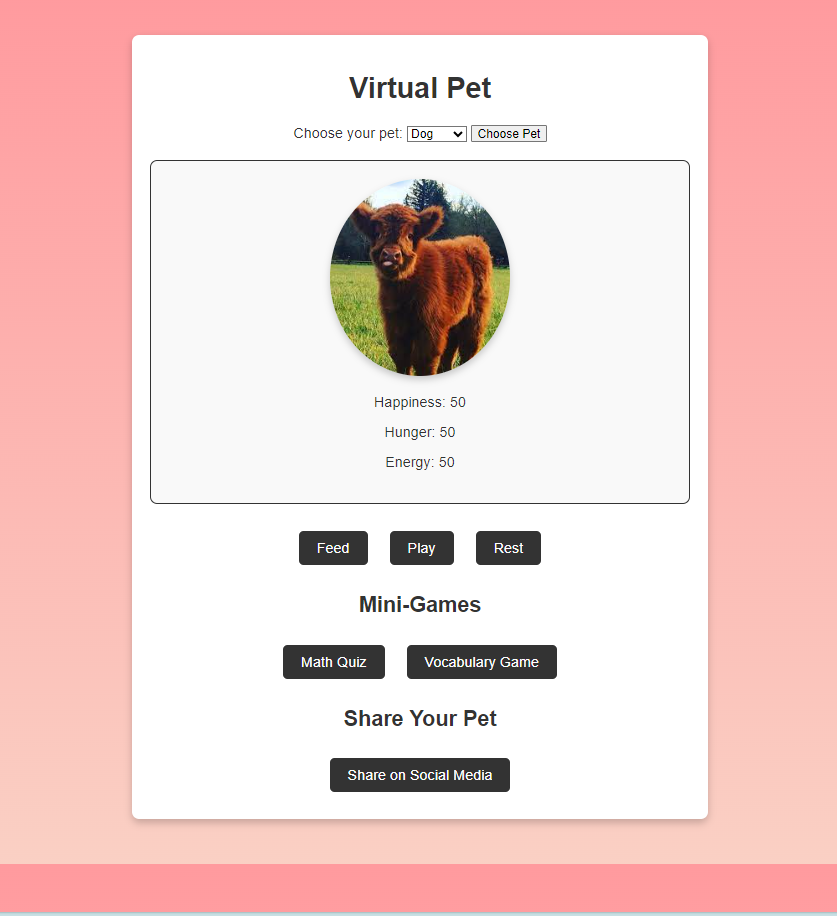
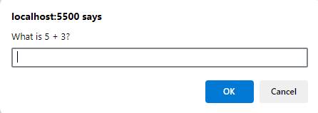
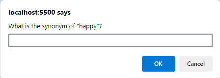
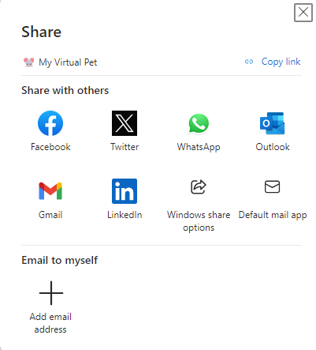

# Virtual Pet App

A simple virtual pet application where users can interact and take care of their virtual pet by feeding, playing, and resting. The pet's happiness, hunger, and energy levels are tracked and updated based on user interactions.

## Features

- **Track Pet Stats**: Monitor the pet's happiness, hunger, and energy levels.
- **Interactive Controls**: Buttons to feed, play with, and rest the pet, affecting its stats.
- **Responsive Design**: The app is styled with CSS to be visually appealing and responsive.

## Technologies Used

- **HTML**: Structure of the application.
- **CSS**: Styling to make the app visually appealing.
- **JavaScript**: Logic for handling user interactions and updating the pet's stats.
day 1: 

day2: 

day3P: , , , 